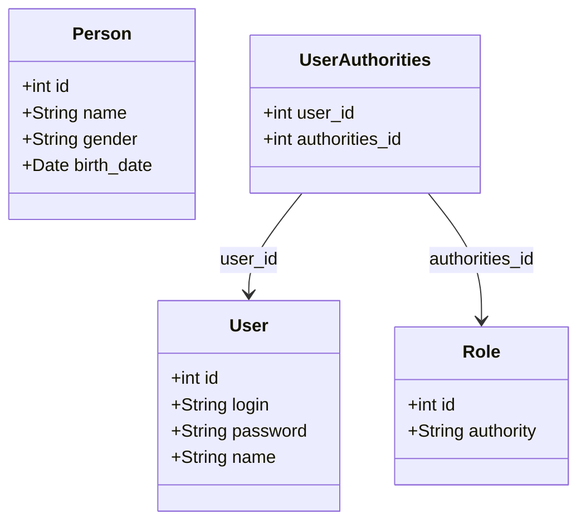

# JAVA SPRINGFRAMEWORK API REST by João Pivatto

 In this repository, you will find an example of a REST API created using Java SpringBoot Framework with SpringSecurity. Besides, the database is also included in the repository. All users created have the passwork encrypted, but if you want to have access, the password is "1234".

 ## Class Diagram

